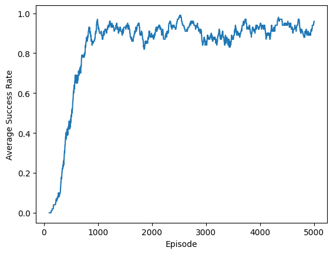
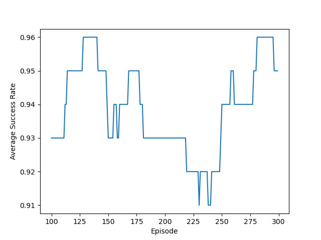
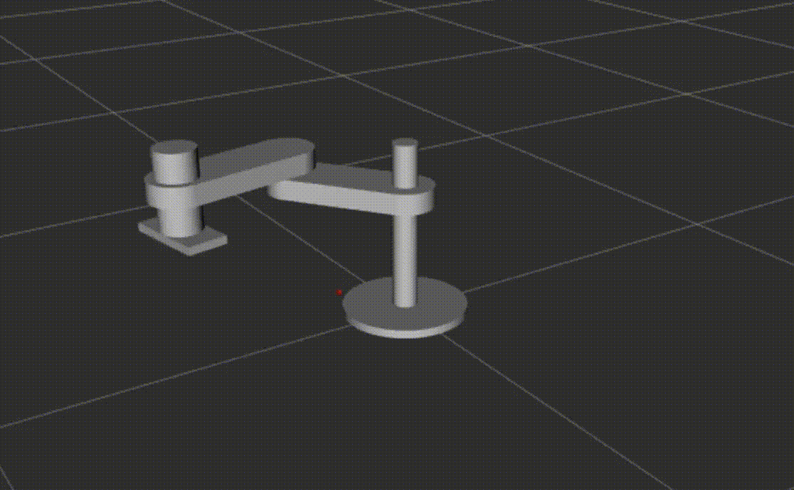

# DDPG RRP Robot with ROS2
# Overview:

This repository aims to create a reinforcement learning script that is able to train a robot to move its end effector from an initial configuration to the target position.

The reinforcement learning method used for this task is the deep deterministic policy gradient (DDPG) method.

# Reward, action and states settings:

The agent set for this task sets the reward function as being the negative of the Euclidean distance between the end effector position and the target position. However, if the reward is less than 0.01 in magnitude, the reward is set to be 10 instead.

The action is set to be the movement of the joints. The joint positions are clipped to be within the joint limits of each joint. The epsilon greedy method was used to increase the exploration factor during training.

The state is composed of the joint state and the displacement of the end effector from the target in 3-dimensional cartesian space.

# How to use:

First, clone the github repository using the command below:

```shell
git clone https://github.com/ChaP2000/DDPG_RRP_Robot_with_ROS2
```

After that, source the ros2 iron framework and build the package within the workspace, followed by sourcing the install/setup.bash.

```shell
source /opt/ros/iron/setup.bash
cd DDPG_RRP_Robot_with_ROS2
colcon build
source ~/DDPG_RRP_Robot_with_ROS2/install/setup.bash
```

# Training:

Training is started by running the train_model executable. The executable is responsible for training the actor and critic model as well as their target counterparts. At the end of training, the executable will output the weights into the checkpoint directory in the package. In addition to this, the executable will output a graph describing the average success rate across the last 100 episodes ran as a graph.

```shell
ros2 run rl_robot train_model
```

# Testing:

Testing can be done by running the test_model executable. The executable is responsible for testing the performance of the models without training. The executable will output a graph describing the average success rate across the last 100 episodes ran as a graph.

```shell
ros2 run rl_robot test_model
```

# Visualizing:

Visualization is done by running the launch file simul.launch.py. The executable will run the launch file "simul.launch.py". The launch file will perform 3 actions: Publish the robot information to the robot_state_publisher, setup the rviz2 configuration for visualization and finally run the move_robot executable to move the robot. 

```shell
ros2 launch rl_robot simul.launch.py
```

# Hyperparameters:

A hyperparameter search was performed for:

lr_a = {5e-5, 1e-4, 5e-4, 1e-3}

lr_c = {5e-4, 1e-3, 5e-3, 1e-2}

batch_size ={64 , 128, 256}

gamma = {0.9, 0.925, 0.95, 0.975, 0.99}

memory = {10000, 30000, 50000}

tau = {0.005, 0.0075, 0.01}

During the search, the torch seed "1111" was used for the weight initialization for neural networks, the number of episodes to truncation is set to 200, and the number of iterations is set to 5000.

The following parameters are chosen for training the model after performing the hyperparameter search:

lr_a = 5e-4

lr_c = 1e-3

batch_size = 64

gamma = 0.9

memory_length = 50000

tau = 0.005

# Example Results:

Training:

The average success rate output across the last 100 iterations from iteration 100 is shown in figure 1.
<p align="center">
  
</p>
<center>Figure 1. Average training success rate across the last 100 episodes</center>

Testing:
The average success rate output across the last 100 iterations from iteration 100 is shown in figure 2.
<p align="center">
  
</p>
<center>Figure 2. Average testing success rate across the last 100 episodes</center>

Testing:

# Video
An example of the test simulation is shown below. The small red dot denotes the target position that the end effector of the robot must reach before truncation.




# Dependencies:

-Pytorch

-Ros2-Iron (robot_state_publisher, sensor_msgs, visualization_msgs, rviz2, xacro)

-numpy

-matplotlib